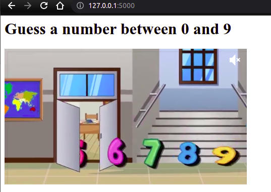
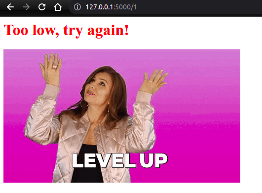
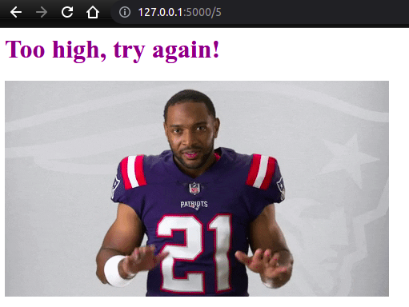
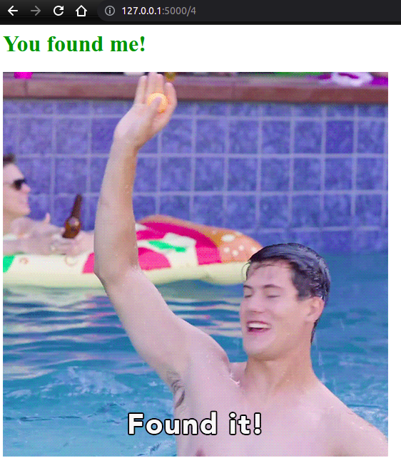

# HTML & URL Parsing in Flask and the Higher Lower Game

## Concepts

- Advanced Decorators with `*args` and `**kwargs`
- Rendering HTML elements
- Parsing URLs
- Flask Debugging

---
### Final Project

# [Higher Lower Game](final/higher-lower)

Guess a number between 0 and 9 using url. 

